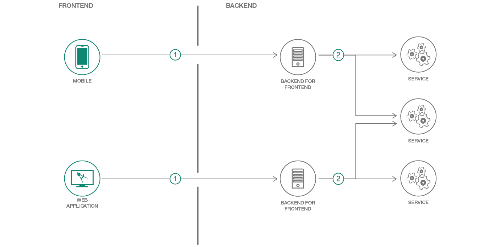

[](https://bluemix.net)


# Create and deploy a Swift Backend For Frontend (BFF) using Kitura

> We have similar patterns available for [Node.js](https://github.com/IBM/nodejs-backend-for-frontend), [Java Spring](https://github.com/IBM/spring-backend-for-frontend), and [Java Liberty](https://github.com/IBM/java-liberty-backend-for-frontend) as well!

In this code pattern, you will create a Backend for Frontend (BFF) web service using [Kitura](https://www.kitura.io/) in Swift, matching a RESTful API documented in [Swagger](http://swagger.io).

A BFF can be used to elegantly expose complex backend systems to multiple client-facing platforms, such as iOS and the web, without building a monolothic API that attempts to serve all clients equally. Different types of clients require different types of user experiences, and having a backend API tightly coupled to each specific user experience actually makes for a much more loosely coupled system overall. This pattern helps frontend teams iterate on features faster by giving them more control over the APIs they interact with, without affecting the user experience or development team driving a sister frontend.

When you have completed this code pattern, you will understand how to:

* Build out the Backend for Frontend (BFF) architecture pattern
* Deploy to Kubernetes, Cloud Foundry or a DevOps Pipeline
* Operate an application with monitoring and distributed trace
* Connect to provisioned services



## Video

Learn more about the Backend for Frontend pattern in this tech talk:

[](https://www.youtube.com/watch?v=B5OdK21ZevI)

## Steps

> As an alternative to the steps below, you can [create this project as a starter kit](https://console.bluemix.net/developer/appservice/create-app?defaultDeploymentToolchain=&defaultLanguage=SWIFT&env_id=ibm%3Ayp%3Aus-south&navMode=catalog&starterKit=827c8244-3d95-3fff-b2bd-0841b587d297) on IBM Cloud, which automatically provisions required services, and injects service credentials into a custom fork of this pattern. Then, you can skip directly to step 3 below.

1. [Install development tools](#1-install-development-tools)
1. [Configuration](#2-configuration)
1. [Run](#3-run)

### 1. Install development tools

#### Local Development Tools Setup

- On Linux, install the [Swift toolchain](http://www.swift.org) version _v3.1.1_.
- On macOS, install [Xcode](https://developer.apple.com/download) _v8.3+_

#### IBM Cloud development tools setup

1. Install [IBM Cloud Developer Tools](https://console.bluemix.net/docs/cli/idt/setting_up_idt.html#add-cli) on your machine
2. Install the plugin with: `ibmcloud plugin install dev -r IBM Cloud`

### 2. Configuration

Your application configuration information is stored in `config.json`. If you selected services added to your project, you will see Cloudant, Object Storage, and other services with their connection information such as username, password, and hostname listed here. This is useful for connecting to remote services while running your application locally.

When you push your application to IBM Cloud, however, these values are no longer used, and instead IBM Cloud automatically connects to those bound services through the use of environment variables. The `config.json` file has been added to the `.gitignore` file so you don't accidently check in the secret credentials.

### 3. Run

#### Using IBM Cloud development CLI

The IBM Cloud development plugin makes it easy to compile and run your application if you do not have all of the tools installed on your computer yet. Your application will be compiled with Docker containers. To compile and run your app, run:

```bash
ibmcloud dev build
ibmcloud dev run
```

#### Using your local development environment

Once the Swift toolchain has been installed, you can compile a Swift project with:

```bash
swift build
```

Your sources will be compiled to your `.build/debug` directory.

#### Endpoints

Your application is running at: `http://localhost:8080/` in your browser.

- Your [Swagger UI](http://swagger.io/swagger-ui/) is running on: `/explorer`
- Your Swagger definition is running on: `/swagger/api`

## Troubleshooting

Using IBM Cloud development CLI, build and debug your app using:

```bash
ibmcloud dev build --debug
ibmcloud dev debug
```

## License

[Apache 2.0](LICENSE)
